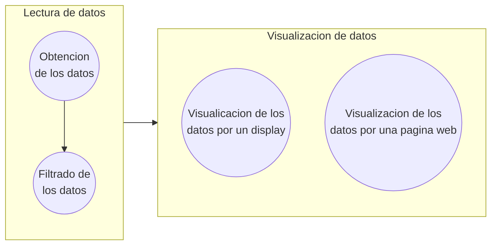

# Ejercicio final : Pulsioximetro 

###### **Funcionamiento**

En el siguiente ejercicio se describe un programa para mostrar por pantalla las medidas que calculan dos dispositivos: el `X` y el `Y`. El funcionamiento del programa se diferencia en 2 etapas muy diferenciadas, cada una ejecutandose en uno de los nucleos del ESP32:



### Lectura de los datos

### Visualizacion de los datos

La visualizacion de los datos se ha implementado de dos maneras diferentes, una por un display y otra por una pagina web. Ambas se ejecutan en el nucleo 1 del ESP32.

#### Display

El display con el que trabajaremos consiste en un GMG12864-06D, el cual es un display de 128x64 pixeles de resolucion. Este display se comunica con el ESP32 mediante el protocolo SPI, por lo que se ha utilizado la libreria `SPI` y `U8g2lib` para facilitar la comunicacion.

El display se connecta al ESP32 mediante 7 pines, los cuales se muestran en la siguiente tabla con su correspondiente descripcion:

|PIN GMG-12864-06D| PIN ESP32 | Descripción |
|-----------------|-----------|-------------|
|CS               |GPIO 5     |Chip Select  |
|RSE              |GPIO 32    |Reset        |
|RS               |GPIO 33    |DC           |
|SCL              |GPIO 18    |SPI Clock    |
|SI               |GPIO 23    |SPI Data     |
|VDD              |3V3        |VCC          |
|VSS              |GND        |GND          |
|A                |47Ω -> 3V3 |Anode        |
|K                |GND        |Cathode      |

Pines utilizados:

| Dispositivo | Uso | GPIO |
|-------------|-----|------|
| GMG-12864-06D | Chip Select | 5 |
| GMG-12864-06D | Reset | 32 |
| GMG-12864-06D | DC | 33 |
| GMG-12864-06D | SPI Clock | 18 |
| GMG-12864-06D | SPI Data | 23 |
| GMG-12864-06D | VCC | 3V3 |
| GMG-12864-06D | GND | GND |
| GMG-12864-06D | Anode | 3V3 |
| GMG-12864-06D | Cathode | GND |
| MAX30102 | SCL | 22 |
| MAX30102 | SDA | 21 |
| MAX30102 | VCC | 3V3 |
| MAX30102 | GND | GND |
| Boton BPM | Boton | 25 |
| Boton BPM | GND | GND |
| Boton SPO2 | Boton | 26 |
| Boton SPO2 | GND | GND |
| Boton Frecuencia | Boton | 27 |
| Boton Frecuencia | GND | GND |

Diagrama de conexionado:

```mermaid
  flowchart LR;

  subgraph MAX30102
    SCL 
    SDA
    VCC_ M 
    GND 
  end

  subgraph GMG-12864-06D
    CS 
    RSE
    RS
    SCL
    SI
    VCC_G
    GND
    A
    K
  end

  subgraph BotonBPM
    Boton
    GND    
  end

  subgraph BotonSPO2

  subgraph BotonFrecuencia
    Boton
    GND
  end

  subgraph ESP32
    32
    33
    18
    23
    3V3
    GND
    22
    21
    25
    26
    27
  end

SCL --> 22
SDA --> 21
VCC_G --> VCC
```


Las principales funciones que se han descrito para su utilización consisten en iniciar el dispositivo y actualizar los datos que provienen de la lectura. Por lo que se ha creado una clase `Display` que contiene las funciones necesarias para su utilización. A continuación podemos ver el código que confroma la clase:

```cpp

#define SCL 18
#define SI 23
#define CS 5
#define RS 32
#define RSE 33

class Display {
  
    U8G2_SSD1306_128X64_NONAME_F_HW_I2C u8g2;
    int8_t xAxisBegin, xAxisEnd, yAxisBegin, yAxisEnd, heartRateYBias, spo2YBias;

    public:
        Display(): u8g2(U8G2_R0, SCL, SI, CS, RS, RSE){}

        void init()
        {
          // Display initialization
          u8g2.begin();                         // Inicializa
          u8g2.setContrast (10);                //contraste
          u8g2.enableUTF8Print();               //Visuliza caracteres UTF-8
          u8g2.setFont(u8g2_font_luBS10_tf );
          //Axis
          height = this -> height();
          width = this -> width();
          
          this -> xAxisBegin      = width  - 126;
          this -> xAxisEnd        = width  - width/2;
          this -> yAxisBegin      = height - 62;
          this -> yAxisEnd        = height - 4;
          this -> heartRateYBias  = height/3;
          this -> spo2YBias       = height - 6;
        }

        void drawAxis()
        {
          u8g2.drawLine(this -> xAxisBegin, this -> yAxisBegin, this -> xAxisBegin, this -> yAxisEnd);                // Y-axis
          u8g2.drawLine(this -> xAxisBegin, this -> yAxisEnd, this -> xAxisEnd, this -> yAxisEnd);                    // X-axis
        }

        void drawData(int *heartRateData, int *spo2Data)
        {
          for (uint8_t i = 0; i < this -> xAxisEnd; i++)
          {
              u8g2.drawPixel(this -> xAxisBegin + i, this -> heartRateYBias - heartRateData[i]);
              u8g2.drawPixel(this -> xAxisBegin + i, this -> spo2YBias - spo2Data[i]);
          }
        }

        void printMesuraments(int bpm_v, int spo2_v)
        {
          String bpm = String(bpm_v);
          String spo = String(spo_v) + " %";

          if ( bpm.length() >= 3)
          {
              u8g2.setCursor(this -> xAxisEnd + 20, this -> heartRateYBias );
          }
          else {
              u8g2.setCursor(this -> xAxisEnd + 28, this -> heartRateYBias);
          }
          u8g2.print(bpm);
          u8g2.setCursor(this -> xAxisEnd + 20, this -> heartRateYBias + 16);
          u8g2.print("BPM");
          u8g2.setCursor(this -> xAxisEnd + 20, this -> spo2YBias );
          u8g2.print(spo);
        }

        void update(int *heartRateData, int *spo2Data, int beatsPerMinute, int spo2Percentage )
        {
          this -> drawAxis()
          this -> drawData(heartRateData, spo2Data);
          this -> printMeasurements(beatsPerMinute, spo2Percentage);
        }
        
        uint8_t heigth()
        {
          return this -> u8g2.getDisplayHeight(); // 64px
        }

        uint8_t width()
        {
          return this -> u8g2.getDisplayWidth(); // 128px
        }
};

```


#### Página web

Por otra parte, para la visualización de los datos mediante la pagina web se ha utilizado la libreria `WiFi` y `AsyncTCP` para la comunicación con el ESP32 y la libreria `ESPAsyncWebServer` para la creación del servidor web.

Para la creación de la pagina web se ha utilizado el lenguaje HTML, CSS y JavaScript. En ella se pueden visualizar dos gráficas una para la frecuencia cardiaca y otra para la saturación de oxigeno en sangre. Además, de los valores calculados en la lectura de los datos.

Las principales funciones que se describen para esta visualización son la creación del servidor web y la funcion en caso de evento del socket.

```cpp
#include "WiFi.h"
#include "SPIFFS.h"
#include "ESPAsyncWebServer.h"

//Server vars.
const char* ssid = "*****";
const char* password =  "******";
 
AsyncWebServer server(80);
AsyncWebSocket ws("/ws");
 
AsyncWebSocketClient * globalClient = NULL;

//Function declaration
void onWsEvent(AsyncWebSocket * server, AsyncWebSocketClient * client, AwsEventType type, void * arg, uint8_t *data, size_t len);
void initWiFi();
void initServer();
void initWeb();
void initSPIFSS();

void initWeb()
{
  initSPIFSS();
  initWiFi();
  initServer();
}

void loop()
{
    if(globalClient != NULL && globalClient->status() == WS_CONNECTED && getNewData())
    {
        globalClient -> text(message);
        message = "";
    }
}

void initSPIFFS()
{
  if(!SPIFFS.begin()){
     Serial.println("An Error has occurred while mounting SPIFFS");
     for(;;);
  }
}

void initWiFi()
{
  WiFi.begin(ssid, password);
 
  Serial.print("Connecting to WiFi..");
  while (WiFi.status() != WL_CONNECTED) {
    delay(1000);
    Serial.print(".");
  }

  Serial.println("");
  Serial.println("IP: ");
  Serial.print(WiFi.localIP());
  Serial.println("");
}

void initServer()
{
  ws.onEvent(onWsEvent);
  server.addHandler(&ws);
 
  server.on("/", HTTP_GET, [](AsyncWebServerRequest *request){
    request->send(SPIFFS, "/index.html", "text/html");
  });
 
  server.begin();
}

void onWsEvent(AsyncWebSocket * server, AsyncWebSocketClient * client, AwsEventType type, void * arg, uint8_t *data, size_t len)
{
 
  if(type == WS_EVT_CONNECT){
 
    Serial.println("Websocket client connection received");
    globalClient = client;
 
  } else if(type == WS_EVT_DISCONNECT){
 
    Serial.println("Websocket client connection finished");
    globalClient = NULL;
 
  }
}
```


###### **Código del programa**

- platformio.ini:

```
[env:esp32doit-devkit-v1]
platform = espressif32
board = esp32doit-devkit-v1
framework = arduino
monitor_speed = 115200
monitor_port = /dev/ttyUSB0
lib_deps =  sparkfun/SparkFun MAX3010x Pulse and Proximity Sensor Library@^1.1.2
```

- main.cpp:

```cpp
#include <Arduino.h>
#include <Wire.h>
#include "MAX30105.h"
#include "heartRate.h"
#include "spo2_algorithm.h"

MAX30105 particleSensor;

#define MAX_BRIGHTNESS 255

uint32_t irBuffer[100]; //infrared LED sensor data
uint32_t redBuffer[100];  //red LED sensor data

int32_t bufferLength; //data length
int32_t spo2; //SPO2 value
int8_t validSPO2; //indicator to show if the SPO2 calculation is valid
int32_t heartRate; //heart rate value
int8_t validHeartRate; //indicator to show if the heart rate calculation is valid

byte readLED = 13; //Blinks with each data read

bool DSR = true;

void initMAX30102();
void determineSignalRate();
void takingSamples();

void setup()
{
  Serial.begin(115200); // initialize serial communication at 115200 bits per second:

  pinMode(readLED, OUTPUT);

  initMAX30102();
}

void loop()
{
  if(DSR)determineSignalRate();
    
  Serial.print(F("\t Heart Rate : "));
  Serial.print(heartRate, DEC);

  Serial.print(F("\t HRvalid : "));
  Serial.print(validHeartRate, DEC);

  Serial.print(F("\t Saturation in oxygen : "));
  Serial.print(spo2, DEC);

  Serial.print(F("\t SPO2Valid : "));
  Serial.println(validSPO2, DEC);
  
  takingSamples();
}

void initMAX30102()
{
  // Initialize sensor
  if (!particleSensor.begin(Wire, I2C_SPEED_FAST)) //Use default I2C port, 400kHz speed
  {
    Serial.println(F("MAX30105 was not found. Please check wiring/power."));
    while (1);
  }
  
  byte ledBrightness = 60;  //Options: 0=Off to 255=50mA
  byte sampleAverage = 4;   //Options: 1, 2, 4, 8, 16, 32
  byte ledMode = 2;         //Options: 1 = Red only, 2 = Red + IR, 3 = Red + IR + Green
  byte sampleRate = 100;    //Options: 50, 100, 200, 400, 800, 1000, 1600, 3200
  int pulseWidth = 411;     //Options: 69, 118, 215, 411
  int adcRange = 4096;      //Options: 2048, 4096, 8192, 16384
  
  particleSensor.setup(ledBrightness, sampleAverage, ledMode, sampleRate, pulseWidth, adcRange); //Configure sensor with these settings
}

void determineSignalRate()
{
  bufferLength = 100; //buffer length of 100 stores 4 seconds of samples running at 25sps
  Serial.print("Determining signal rate ..");
  //read the first 100 samples, and determine the signal range
  for (byte i = 0 ; i < bufferLength ; i++)
  {
    while (particleSensor.available() == false) //do we have new data?
    
    particleSensor.check(); //Check the sensor for new data

    redBuffer[i] = particleSensor.getRed();
    irBuffer[i] = particleSensor.getIR();
    particleSensor.nextSample(); //We're finished with this sample so move to next sample
    if(i%25 == 0)
    {  
      Serial.print('.');
    }
  }
  //calculate heart rate and SpO2 after first 100 samples (first 4 seconds of samples)
  maxim_heart_rate_and_oxygen_saturation(irBuffer, bufferLength, redBuffer, &spo2, &validSPO2, &heartRate, &validHeartRate);
  DSR = false;
  Serial.println("\nSignal determining done!");
}

void takingSamples()//Continuously taking samples from MAX30102.  Heart rate and SpO2 are calculated every 1 second
{
  //dumping the first 25 sets of samples in the memory and shift the last 75 sets of samples to the top
  for (byte i = 25; i < 100; i++)
  {
    redBuffer[i - 25] = redBuffer[i];
    irBuffer[i - 25] = irBuffer[i];
  }

  //take 25 sets of samples before calculating the heart rate.
  for (byte i = 75; i < 100; i++)
  {
    while (particleSensor.available() == false) //do we have new data?
      particleSensor.check(); //Check the sensor for new data

    digitalWrite(readLED, !digitalRead(readLED)); //Blink onboard LED with every data read

    redBuffer[i] = particleSensor.getRed();
    irBuffer[i] = particleSensor.getIR();
    particleSensor.nextSample(); //We're finished with this sample so move to next sample
  }

  //After gathering 25 new samples recalculate HR and SP02
  maxim_heart_rate_and_oxygen_saturation(irBuffer, bufferLength, redBuffer, &spo2, &validSPO2, &heartRate, &validHeartRate);
}
```

###### **Salida del puerto serie**

```
Determining signal rate ......
Signal determining done!
Heart Rate : 136         HRvalid : 1     Saturation in oxygen : 75       SPO2Valid : 1
Heart Rate : 150         HRvalid : 1     Saturation in oxygen : 69       SPO2Valid : 1
Heart Rate : 60          HRvalid : 1     Saturation in oxygen : 34       SPO2Valid : 1
Heart Rate : 88          HRvalid : 1     Saturation in oxygen : 93       SPO2Valid : 1
Heart Rate : 125         HRvalid : 1     Saturation in oxygen : 72       SPO2Valid : 1
Heart Rate : 107         HRvalid : 1     Saturation in oxygen : 99       SPO2Valid : 1
...
```

###### **Montaje**

