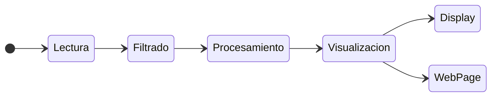

# Proyecto final : Pulsioximetro 

En el siguiente repositorio se describe la implementacion de un pulsioximetro, el cual se ha implementado en un ESP32. Este proyecto se ha realizado para la asignatura de Procesadores Digitales (PD) de la Universidad Politecnica de Catalunya (UPC).

> **NOTA**: La explicacion que se muestra a continuacion es una explicacion resumida del proyecto. Para una explicacion mas detallada se puede consultar directamente el codigo, el cual esta comentado siguiendo la documentacion de [Doxygen](https://www.doxygen.nl/index.html).

## **Funcionamiento**

El funcionamiento de este proyecto se basa en la lectura de los datos del sensor *MAX30102*, el filtrado de estos datos, la obtencion de los datos de interes y la visualizacion de estos datos mediante un *display* y una pagina web.



### Lectura de los datos

***

Para la lectura de los datos se ha utilizado la libreria `Wire` y `MAX30102` para la comunicacion I2C con el sensor *MAX30102*. Ademas, se ha creado una clase `globalDataReader` que contiene las funciones necesarias para la lectura de los datos. Las funciones de esta clase se han implementado en el nucleo 0 del ESP32.

###### **Cabecera de la clase**

```cpp
#ifndef DATAREADER_H
#define DATAREADER_H

#include <Arduino.h>
#include <Wire.h>
#include <vector>
#include <SPIFFS.h>

#include "MAX30105.h"
#include "heartRate.h"
#include "arduinoFFT.h"
#include "spo2_algorithm.h"

#include "GlobalValues.h"

namespace std
{
    /** Global data reader class
     *
     * @brief This class is the global data reader of the device.
     *
     * @details This class is used to manage the global data reader of the device.
     *
     * @param particleSensor MAX30105 object
     * @param enoughSamples Number of samples to be taken
     * @param irBuffer IR buffer
     * @param redBuffer Red buffer
     * @param vCoefs Coefficients of the filter
     * @param bufferLenght Buffer length
     * @param spo2Percentage SPO2 percentage
     * @param heartRate Heart rate
     * @param validSPO2 Valid SPO2
     * @param validHeartRate Valid heart rate
     * @param inputIRData Input IR data
     * @param inputRedData Input red data
     * @param filteringIterations Filtering iterations
     * @param dataReady Data ready
     *
     */
    class globalDataReader {
        // sensor
        MAX30105 particleSensor;

        // variables for data reading
        int enoughSamples;
        uint32_t* irBuffer;
        uint32_t* redBuffer;
        float* vCoefs;
        int32_t bufferLenght, spo2Percentage, heartRate;
        int8_t validSPO2, validHeartRate;

        // filter variables
        vector<float> inputIRData;
        vector<float> inputRedData;
        int filteringIterations = 0; 

        // Confrimation variables
        bool dataReady = false;

        public:
            globalDataReader ( int pEnoughSamples = 200 );

            void setup ();

            void initMAX30102 ( byte ledBrightness = 0x1F, byte sampleAverage = 4, byte ledMode = 3, 
                                int sampleRate = 3200, int pulseWidth = 411, int adcRange = 4096 );

            void readFile ( String fileName = "/coefficients.txt" );

            void readData ( globalValues& globalValuesVar, uint8_t SAMPLES, uint8_t SAMPLING_FREQUENCY );

            void readValuesFromSensor ();

            void doFiltering ( float& resultOfIR, float& resultOfRed );

            void setGlobalValues ( globalValues& globalValuesVar );
            
            void printData ();

            void fft ( globalValues& globalValuesVar, uint8_t SAMPLES, uint8_t SAMPLING_FREQUENCY );

            vector<fundamentalsFreqs> getFFTResults ( double* vReal, uint8_t SAMPLES, uint8_t SAMPLING_FREQUENCY );

            bool isDataReady ();
    };
}

#endif /* DATAREADER_H *
```


#### Filtrado de los datos

Para el filtrado de los datos se ha utilizado la libreria `arduinoFFT` para la transformada de Fourier y la libreria `spo2_algorithm` y `heartRate` para el calculo de la saturacion de oxigeno en sangre y el ritmo cardiaco respectivamente.

La funcion del filtrado, implementada dentro de la clase `globalDataReader`, consiste en la lectura de los datos del sensor, el filtrado de estos datos y la obtencion de los datos de interes.

###### **Código del programa**

```cpp
/** Read data function
 * 
 * @brief This function reads the data from the sensor.
 *
 * @param globalValuesVar Global values variable.
 * @param SAMPLES Number of samples.
 * @param SAMPLING_FREQUENCY Sampling frequency.
 * 
 * @details This functions reads the data from the sensor and, when it has enough samples,
 *          it applies the filter and sends the data to the heart rate algorithm. Finally,
 *          the output data is stored in the global values variable and printed.
 * 
 * @see readValuesFromSensor(), doFiltering(), setGlobalValues(), printData().
 *  
 */
void globalDataReader::readData ( globalValues& globalValuesVar, uint8_t SAMPLES, uint8_t SAMPLING_FREQUENCY )
{
    float resultOfIR = 0.0;
    float resultOfRed = 0.0;

    readValuesFromSensor();
    // we have enough samples to apply the filter
    if ( inputIRData.size() > enoughSamples )
    {
        doFiltering(resultOfIR, resultOfRed);

        //we have enough samples to send to the heart rate algorithm
        if ( filteringIterations >= enoughSamples )
        {
            filteringIterations = 0;
            setGlobalValues(globalValuesVar);
            printData();
            fft(globalValuesVar, SAMPLES, SAMPLING_FREQUENCY);
            dataReady = true;
        }
        irBuffer[filteringIterations] = resultOfIR;
        redBuffer[filteringIterations] = resultOfRed;    
        filteringIterations++;
    }
}

/** Read values from sensor function
 * 
 * @brief This function reads the values from the sensor and stores the values in its
 *        respective arrays.
 * 
 * @see readData().
 * 
 */
void globalDataReader::readValuesFromSensor ( )
{
    // read the value from the sensor
    float valueIR = particleSensor.getIR();
    float valueRed = particleSensor.getRed();

    // add the new sample to the input data vector
    inputIRData.push_back(valueIR); 
    inputRedData.push_back(valueRed);
}

/** Do filtering function
 * 
 * @brief This function does the filtering of the input data and stores it.
 * 
 * @param resultOfIR Result of the convolution of the filter and the IR array.
 * @param resultOfRed Result of the convolution of the filter and the Red array. 
 * 
 */
void globalDataReader::doFiltering ( float& resultOfIR, float& resultOfRed )
{
    for (int n = enoughSamples; n >= 0; n--) 
    {
        resultOfIR += vCoefs[n] * inputIRData[inputIRData.size() - n - 1];
        resultOfRed += vCoefs[n] * inputRedData[inputRedData.size() - n - 1];
        
    }
    // delete the oldest sample from the list
    inputIRData.erase(inputIRData.begin()); 
    inputRedData.erase(inputRedData.begin());
}
```

#### FFT

La funcion de la FFT, implementada dentro de la clase `globalDataReader`, consiste en la aplicacion de la FFT a los datos y la obtencion de las frecuencias fundamentales.

###### **Código del programa**

```cpp
/** FFT function
 * 
 * @brief This function applies the FFT to the data.
 * 
 * @param globalValuesVar Global values variable.
 * @param SAMPLING_FREQUENCY Sampling frequency.
 * @param SAMPLES Number of samples.
 * 
 * @details This function applies the FFT to the data and stores the results in the
 *         global values variable.
 * 
 */
void globalDataReader::fft ( globalValues& globalValuesVar, uint8_t SAMPLES, uint8_t SAMPLING_FREQUENCY )
{
    Serial.println("Computing FFT...");
    
    /***TODO: GET 4 MAX AND SHOW ITS HZ IN DISPLAY*/

    arduinoFFT FFT = arduinoFFT();
    double vReal[SAMPLES];
    double vImag[SAMPLES];
    for (int i = 0; i < SAMPLES; i++)
    {
        vReal[i] = irBuffer[i];
        vImag[i] = 0;
    }

    FFT.Compute(vReal, vImag, SAMPLES, FFT_FORWARD);
    FFT.ComplexToMagnitude(vReal, vImag, SAMPLES);
    vReal[0] = 0; // Remove the DC component

    vector<fundamentalsFreqs> fftResults = getFFTResults( vReal, SAMPLES, SAMPLING_FREQUENCY );
    globalValuesVar.setFreqs( fftResults );
}

/** Get FFT results function
 * 
 * @brief This function gets the FFT results.
 * 
 * @param vReal Real part of the FFT.
 * @param SAMPLES Number of samples.
 * @param SAMPLING_FREQUENCY Sampling frequency.
 * 
 * @return Vector of fundamentals frequencies.
 * 
 */
vector<fundamentalsFreqs> globalDataReader::getFFTResults ( double* vReal, uint8_t SAMPLES, uint8_t SAMPLING_FREQUENCY )
{
    Serial.println("FFT results:");

    vector<fundamentalsFreqs> freqs;
    for (int i = 0; i < SAMPLES / 2; i++)
    {
        float frequency = float(i) * SAMPLING_FREQUENCY / SAMPLES;
        float magnitude = vReal[i];
        fundamentalsFreqs x;
        x.amplitude=magnitude;
        x.freqsHz=frequency;
        freqs.push_back(x);
        
        Serial.print("Frequency: ");
        Serial.print(frequency);
        Serial.print(" Hz, Magnitude: ");
        Serial.println(magnitude);
    }
    return freqs;
}
```

### Guardado de los datos

***

Con la finalidad de facilitar el traspaso de datos entre las dos tareas principales, se ha implementado una clase para acceder y modificar estos datos. 

###### **Cabecera de la clase**

```cpp
#ifndef GLOBALVALUES_H
#define GLOBALVALUES_H

#include <Arduino.h>
#include <vector>

namespace std
{
    /** Fundamentals frequencies struct
     * 
     * @brief This struct is the fundamentals frequencies of the device.
     * 
     * @details This struct is used to store the fundamentals frequencies of the heart rate.
     * 
     * @param freqsHz Frequency in Hz
     * @param amplitude Amplitude of the frequency
     *
     */
    struct fundamentalsFreqs{
        float freqsHz;
        float amplitude;
    };

    /** Global values class
     * 
     * @brief This class is the global values of the device.
     * 
     * @details This class is used to store the global values of the device.
     * 
     * @param heartRateDataArray Array of heart rate data
     * @param beatsPerMinute Beats per minute
     * @param spo2Percentage Spo2 percentage
     * @param freqs Fundamentals frequencies
     *
     */
    class globalValues {
        vector<uint32_t> heartRateDataArray;
        vector<fundamentalsFreqs> freqs;
        int32_t beatsPerMinute, spo2Percentage;

        public:
            globalValues ();
            
            globalValues ( vector<uint32_t> heartRateDataArray, int32_t beatsPerMinute, 
                        int32_t spo2Percentage, vector<fundamentalsFreqs> freqs );

            void pushBackHeartRateDataArray ( uint32_t* pHeartRateDataArray, uint32_t size);

            void setHeartRateDataArray ( vector <uint32_t>heartRateDataArray );
            
            void setBeatsPerMinute ( int32_t beatsPerMinute );

            void setSpo2Percentage ( int32_t spo2Percentage );

            void setFreqs ( vector<fundamentalsFreqs> freqs);
            
            vector<uint32_t> getHeartRateDataArray();

            vector<uint32_t> getHeartRateDataArray( uint32_t N );
                        
            uint32_t getFirstValueHeartRate();
            
            void shiftHeartRate();

            int32_t getBeatsPerMinute();

            int32_t getSpo2Percentage();
        
            vector<fundamentalsFreqs> getFreqs();
    };
}
#endif /* GLOBALVALUES_H */
```

### Visualizacion de los datos

***

Para la visualizacion de los datos se ha utilizado un display y una pagina web. Para la implementacion de estos se ha utilizado la libreria `SPI` y `U8g2lib` para el display y la libreria `WiFi` y `ESPAsyncWebServer` para la pagina web. Ambos metodos de visualizacion se han implementado en una clase `globalDataVisualizer` que contiene como atributos un clase `Display` y una clase `WebPage`. Las funciones de esta clase se han implementado en el nucleo 1 del ESP32.

#### Display

El display con el que trabajaremos consiste en un GMG-12864-06D, un display de 128x64 pixeles de resolucion. Este display se comunica con el ESP32 mediante el protocolo SPI, por lo que se ha utilizado la libreria `SPI` y `U8g2lib` para facilitar la comunicacion.

El display se connecta al ESP32 mediante 7 pines, los cuales se muestran en la siguiente tabla con su correspondiente descripcion:

|PIN GMG-12864-06D| PIN ESP32 | Descripción |
|-----------------|-----------|-------------|
|CS               |GPIO 5     |Chip Select  |
|RSE              |GPIO 32    |Reset        |
|RS               |GPIO 33    |DC           |
|SCL              |GPIO 18    |SPI Clock    |
|SI               |GPIO 23    |SPI Data     |
|VDD              |3V3        |VCC          |
|VSS              |GND        |GND          |
|A                |47Ω -> 3V3 |Anode        |
|K                |GND        |Cathode      |

El display se ha programado para que muestre tres tipos de datos, el ritmo cardiaco, el porcentaje de oxigeno en sangre y las frecuencias fundamentales. Para ello se ha creado una clase `Display` que hereda de la clase `U8G2_ST7565_ERC12864_1_4W_SW_SPI` de la libreria `U8g2lib`. Esta clase contiene las funciones necesarias para mostrar los datos en el display.

Dentro de la clase `Display` se han implementado las siguientes funciones:

- `init()`: Esta funcion inicializa el display.
- `drawAxis()`: Esta funcion dibuja los ejes del display.
- `drawData()`: Esta funcion dibuja los datos en el display.
- `printMeasurements()`: Esta funcion imprime los datos en el display.
- `drawBars()`: Esta funcion dibuja las barras en el display.
- `getYAxisBias()`: Esta funcion devuelve el valor del eje Y.
- `getDataWindowSize()`: Esta funcion devuelve el tamaño de la ventana de datos.

Se puede alternar entre los modos de visualizacion mediante tres pulsadores que cambian entre los estados descritos. Para la implementacion de estos se ha definido una clase `Button` y una funcion `readButtons`, que se ejecuta mediante interrupciones por timer, que se encarga de filtrar los pulsos de los botones y cambiar el estado de la variable `orden` a 1 si se pasa el filtro anti-rebote. Esta funcion se ha implementado como su puede ver a continuacion:

```cpp
/** Button management function
 * 
 * @brief This function reads the buttons.
 *  
 * @return void.
 *  
 * @details This function reads the buttons' values and changes the order of the buttons.
 *  
 * @note This function is called when the timer is activated. 
 * 
 */
void buttonsArray::readButtons()
{ 
    for(uint8_t i = 0; i < buttons.size(); i++)
    {
        buttons[i].actualValue = digitalRead(buttons[i].pin);                        // Read the value of the button
        buttons[i].actualChange = buttons[i].previousValue ^ buttons[i].actualValue; // XOR of actual value and last value
        if(buttons[i].actualChange == 1 && buttons[i].previousChange == 1)           // If both status changes are equal to 1
        {
            buttons[i].order = 1;                                                    // Order to 1
            for (uint8_t j = 0; j < buttons.size(); j++)
            {
                if (j != i)buttons[j].order = 0;                                     // Rest of orders to 0 
            }
            buttons[i].previousValue = buttons[i].actualValue;                       // Last value equal to actual value
            buttons[i].previousChange = 0;                                           // Last status change equal to 0
            return;
        }
        buttons[i].previousChange = buttons[i].actualChange;                         // Last status change is equal to acutal change
    }
}
```

> **NOTA**: En caso de necesitar más información sobre la implementación de los botones, se puede consultar el archivo `Button.h` y `Button.cpp`.

###### **Cabecera de la clase**

```cpp
#ifndef DISPLAY_H
#define DISPLAY_H

#include <vector>
#include <U8g2lib.h>
#include <SPI.h>

namespace std
{
    /** Display class
     *
     * @brief This class is the display of the device.
     *
     * @details This class is used to manage the display of the device.
     *
     * @param xAxisBegin X axis begin
     * @param xAxisEnd X axis end
     * @param yAxisBegin Y axis begin
     * @param yAxisEnd Y axis end
     * @param halfHeight Half height of the display
     * @param margin Margin of the display
     *
     */
    class Display : public U8G2_ST7565_ERC12864_1_4W_SW_SPI{
        uint32_t xAxisBegin, xAxisEnd, yAxisBegin, yAxisEnd, halfHeight, margin;
        
        public:
            using U8G2_ST7565_ERC12864_1_4W_SW_SPI::U8G2_ST7565_ERC12864_1_4W_SW_SPI;

            void init ();

            void drawAxis ( bool longAxis = false );

            void drawData ( vector<uint32_t> dataVector );

            void printMeasurements (int32_t value, bool heartRateType );

            void drawBars ( const vector<String>& labels, const vector<float>& amplitudes );
            
            uint32_t getYAxisBias ( );

            uint32_t getDataWindowSize ();
    };
}
#endif /* DISPLAY_H */
```

#### Página web

En lo que respecta a la implementacion de la pagina web, se ha utilizado la libreria `ESPAsyncWebServer` para la creacion del servidor web. Para la creacion de la pagina web se ha utilizado el lenguaje HTML, CSS y JavaScript. En ella se pueden visualizar dos graficas una para la frecuencia cardiaca y otra para la saturacion de oxigeno en sangre. Ademas, de los valores calculados en la lectura de los datos.

El codigo en *JavaScript* de la pagina web prinipalmente se encarga de la creacion de las graficas y de la comunicacion con el servidor mediante *WebSockets*. Para la creacion de las graficas se ha utilizado la libreria `Chart.js`. Para la comunicacion con el servidor se han utilizado mensajes *JSON*.

En pocas palabras, los datos calculados se agrupan en un mensaje *JSON* (se puede ver un ejemplo en la documentacion del codigo) y se envian al servidor mediante *WebSockets*. El servidor recibe el mensaje y actualiza los datos de la pagina web.

###### **Cabecera de la clase**

```cpp
#ifndef WEBPAGE_H
#define WEBPAGE_H

#include <Arduino.h>
#include <ESPAsyncWebServer.h>
#include <WiFi.h>
#include <SPIFFS.h>

/** Web page class 
 * @brief Class to manage the web page
 * 
 * @details This class is used to manage the web page
 * 
 * @param webServer AsyncWebServer object
 * @param webSocket AsyncWebSocket object
 * @param globalClient AsyncWebSocketClient object
 * 
 */
class webPage{
    AsyncWebServer webServer;
    AsyncWebSocket webSocket;
    AsyncWebSocketClient * globalClient;

    public:
        webPage(int port = 80);

        void begin(const char* ssid, const char* password);

        void initWiFi(const char* ssid, const char* password);

        void initServer();

        void onWsEvent (AsyncWebSocket * server, AsyncWebSocketClient * client, 
                        AwsEventType type, void * arg, uint8_t *data, size_t len);

        void sendWsMessage(String message);
};

#endif /* WEBPAGE_H */
```

###### **Código principal en Javascript de la página web**

```javascript
// Constants
const maxDataLength = 32;
// Arrays
let heartRateArray = [];
let timeArray = [];
let freqsHz = [];
let freqsAmplitude = [];

// Last values
let lastFreqsHz = [];
let lastFreqsAmplitude = [];
let lastRawTime = 0;

// Values vars
let beatsPerMinuteValue = "Calculating BPM...";
let spo2PercentageValue = "Calculating SPO2...";

// Conectar al WebSocket del ESP32
var socket = new WebSocket('ws://' + location.hostname + '/ws');
socket.onmessage = function (event) {
    // get new data
    var jsonData = JSON.parse(event.data);

    // update beats per minute and spo2
    var beatsPerMinute = jsonData.beatsPerMinute;
    beatsPerMinuteValue = beatsPerMinute + " BPM";
    document.getElementById('heartrate').innerHTML = beatsPerMinuteValue;
    
    var spo2Percentage = jsonData.spo2Percentage;
    spo2PercentageValue = spo2Percentage + " %";
    document.getElementById('spo2').innerHTML = spo2PercentageValue;

    // update heartRateArray, spo2Array and timeArray
    var newHeartRateData = jsonData.heartRateData;
    heartRateArray.push(newHeartRateData);
    if (heartRateArray.length >= maxDataLength) heartRateArray.shift();

    if(lastRawTime != 0)
    {
        var actualTime = Date.now();
        var millisTimeDifference = actualTime - lastRawTime;
        var timeDifferenceBetweenData = millisTimeDifference/1000;
        
        // calculate accomulated time and round it to 3 decimals
        var accomulatedTime = Math.floor((timeArray[timeArray.length - 1] + timeDifferenceBetweenData)*1000)/1000;        
        lastRawTime = actualTime;
        timeArray.push(accomulatedTime);
    } else {
        lastRawTime = Date.now();
        timeArray.push(0);
    }
    if ( timeArray.length > maxDataLength ) timeArray.shift();
    
    cardiogramaChart.update();
    
    // update freqsHz and freqsAmplitude
    var freqsDataHz = jsonData.freqsHz;
    var similarityBetweenHzArrays =  (lastFreqsHz.length == freqsDataHz.length) 
        && lastFreqsHz.every(function(element, index) {
        return element === freqsDataHz[index]; 
    });

    if (!similarityBetweenHzArrays){
        freqsHz.length = 0;
        for(var i = 0; i < freqsDataHz.length; i++)
        {
            freqsHz.push(freqsDataHz[i]);
        }
        lastFreqsHz = freqsDataHz;
    }
    
    var freqsDataAmplitude = jsonData.freqsAmplitude;
    var similarityBetweenAmplitudeArrays = (lastFreqsAmplitude.length == freqsDataAmplitude.length) 
        && lastFreqsAmplitude.every(function(element, index) {
        return element === freqsDataAmplitude[index]; 
    });
    if (!similarityBetweenAmplitudeArrays){
        freqsAmplitude.length = 0;
        for(var i = 0; i < freqsDataAmplitude.length; i++){
            freqsAmplitude.push(freqsDataAmplitude[i]);
        }
        lastFreqsAmplitude = freqsDataAmplitude;
        
        freqsChart.update();
    }
}
```

## **Esquema de connexiones**

Para la conexión de los dispositivos se ha utilizado el siguiente pinout:

| Dispositivo      | Uso         | GPIO |
|------------------|-------------|------|
| GMG-12864-06D    | Chip Select | 5    |
| GMG-12864-06D    | Reset       | 32   | 
| GMG-12864-06D    | DC(RS)      | 33   |
| GMG-12864-06D    | SPI Clock   | 18   | 
| GMG-12864-06D    | SPI Data    | 23   |
| GMG-12864-06D    | VCC         | 3V3  |    
| GMG-12864-06D    | GND         | GND  |
| GMG-12864-06D    | Anode       | 3V3  |
| GMG-12864-06D    | Cathode     | GND  |
| MAX30102         | SCL         | 22   |
| MAX30102         | SDA         | 21   |
| MAX30102         | VCC         | 3V3  |
| MAX30102         | GND         | GND  |
| Boton BPM        | PIN         | 25   |
| Boton BPM        | GND         | GND  |
| Boton SPO2       | PIN         | 26   |
| Boton SPO2       | GND         | GND  |
| Boton Frecuencia | PIN         | 27   |
| Boton Frecuencia | GND         | GND  |


###### **Esquema de connexiones**


## **Montaje**

Respecto al montaje del proyecto, se ha utilizado una placa de prototipado para connectar los dispositivos y el ESP32. Todos los dispositivos han sido colocados dentro de una caja de madera con tal de facilitar su portabilidad. Cabe destacar que todos los cables de connexiones han sido soldados para evitar que se desconecten durante el uso del dispositivo.

El resultado final es el siguiente:


Se pueden consultar más imagenes del montaje del proyecto en la carpeta `images`.

## **Resultados**

Se pueden consultar los resultados del proyecto en la carpeta `images/results`. En esta carpeta se pueden econtrar videos de la visualizacion de los datos en el display y en la pagina web.
