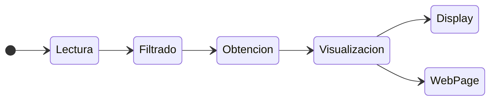
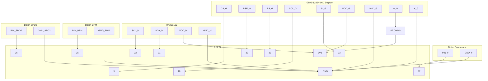

# Ejercicio final : Pulsioximetro 

## **Funcionamiento**

En el siguiente ejercicio se describe un programa para mostrar por pantalla las medidas que calculan dos dispositivos: el `X` y el `Y`. El funcionamiento del programa se diferencia en 2 etapas muy diferenciadas, cada una ejecutandose en uno de los nucleos del ESP32:



### Lectura de los datos

#### Filtrado de los datos

Para el filtrado de los datos se ha utilizado un filtro FIR, el cual se ha implementado en el nucleo 0 del ESP32. El filtro FIR se ha implementado mediante la libreria `FIRFilter`, la cual se ha modificado para que se pueda utilizar con el ESP32. El filtro FIR se ha implementado con una frecuencia de muestreo de 100Hz y una frecuencia de corte de 5Hz.

#### Obtencion de los datos

Para la obtencion de los datos se ha utilizado un sensor MAX30102, el cual se ha conectado al ESP32 mediante el protocolo I2C. Para facilitar la comunicacion se ha utilizado la libreria `Wire`. El sensor MAX30102 se ha conectado al ESP32 mediante 4 pines, los cuales se muestran en la siguiente tabla con su correspondiente descripcion:

|PIN MAX30102| PIN ESP32 | Descripción |
|------------|-----------|-------------|
|SCL         |GPIO 22    |I2C Clock    |
|SDA         |GPIO 21    |I2C Data     |
|VDD         |3V3        |VCC          |
|GND         |GND        |GND          |

###### **Código del programa**

- **platformio.ini:**

```ini
[env:esp32doit-devkit-v1]
platform = espressif32
board = esp32doit-devkit-v1
framework = arduino
monitor_speed = 115200
monitor_port = /dev/ttyUSB0
lib_deps =  sparkfun/SparkFun MAX3010x Pulse and Proximity Sensor Library@^1.1.2
```
- **main.cpp:**

```cpp
```

###### **Salida del puerto serie**

```
Determining signal rate ......
Signal determining done!
Heart Rate : 136         HRvalid : 1     Saturation in oxygen : 75       SPO2Valid : 1
Heart Rate : 150         HRvalid : 1     Saturation in oxygen : 69       SPO2Valid : 1
Heart Rate : 60          HRvalid : 1     Saturation in oxygen : 34       SPO2Valid : 1
Heart Rate : 88          HRvalid : 1     Saturation in oxygen : 93       SPO2Valid : 1
Heart Rate : 125         HRvalid : 1     Saturation in oxygen : 72       SPO2Valid : 1
Heart Rate : 107         HRvalid : 1     Saturation in oxygen : 99       SPO2Valid : 1
[...]
```

***

### Obtencion de los datos

Con tal de transmitir los datos obtenidos por el sensor MAX30102 se ha utilizado una clase global `globalValues`, la cual contiene las variables globales que se utilizan en el programa. A continuación podemos ver el código que confroma la clase:

###### **Código del programa**

- **platformio.ini:**

```ini
[env:esp32doit-devkit-v1]
platform = espressif32
board = esp32doit-devkit-v1
framework = arduino
monitor_speed = 115200
monitor_port = /dev/ttyUSB0
lib_deps =  olikraus/U8g2@^2.34.17
```
- **main.cpp:**

```cpp
/** Fundamentals frequencies struct
 * 
 * @brief This struct is the fundamentals frequencies of the device.
 *
 */
struct fundamentalsFreqs{
    String freqsHz;
    int amplitude;
};

/** Global values class
 * 
 * @brief This class is the global values of the device.
 *
 */
class globalValues {
    int32_t* heartRateDataArray;
    int32_t* spo2DataArray;
    int32_t beatsPerMinute, spo2Percentage;
    vector <fundamentalsFreqs> freqs;
    
    public:
        /** Global values default constructor
         * 
         * @brief This function is the constructor of the global values.
         *
         */
        globalValues()
        {
            this -> heartRateDataArray = 0;
            this -> spo2DataArray = 0;
            this -> beatsPerMinute = 0;
            this -> spo2Percentage = 0;
            this -> freqs = {};
        }
        
        /** Global values constructor
         * 
         * @brief This function is the constructor of the global values.
         *
         * @param heartRateDataArray Heart rate data array.
         * @param spo2DataArray SPO2 data array.
         * @param beatsPerMinute Beats per minute.
         * @param spo2Percentage SPO2 percentage.
         * @param freqs Fundamentals frequencies.
         */
        globalValues(int32_t* heartRateDataArray, int32_t* spo2DataArray, int32_t beatsPerMinute, int32_t spo2Percentage, vector<fundamentalsFreqs> freqs)
        {
            this -> heartRateDataArray = heartRateDataArray;
            this -> spo2DataArray = spo2DataArray;
            this -> beatsPerMinute = beatsPerMinute;
            this -> spo2Percentage = spo2Percentage;
            this -> freqs = freqs;
        }

        /** Set heart rate data array function
         * 
         * @brief This function sets the heart rate data array.
         * 
         * @param heartRateDataArray Heart rate data array.
         */
        void setHeartRateDataArray(int32_t* heartRateDataArray)
        {
            this -> heartRateDataArray = heartRateDataArray;
        }

        /** Set SPO2 data array function
         * 
         * @brief This function sets the SPO2 data array.
         * 
         * @param spo2DataArray SPO2 data array.
         */
        void setSpo2DataArray(int32_t* spo2DataArray)
        {
            this -> spo2DataArray = spo2DataArray;
        }

        /** Set beats per minute function
         * 
         * @brief This function sets the beats per minute.
         * 
         * @param beatsPerMinute Beats per minute.
         */
        void setBeatsPerMinute(int32_t beatsPerMinute)
        {
            this -> beatsPerMinute = beatsPerMinute;
        }

        /** Set SPO2 percentage function
         * 
         * @brief This function sets the SPO2 percentage.
         * 
         * @param spo2Percentage SPO2 percentage.
         */
        void setSpo2Percentage(int32_t spo2Percentage)
        {
            this -> spo2Percentage = spo2Percentage;
        }

        /** Set fundamentals frequencies function
         * 
         * @brief This function sets the fundamentals frequencies.
         * 
         * @param freqs Fundamentals frequencies.
         */
        void setFreqs(vector<fundamentalsFreqs> freqs)
        {
            this -> freqs = freqs;
        }

        /** Get heart rate data array function
         * 
         * @brief This function gets the heart rate data array.
         * 
         * @return Heart rate data array.
         */
        int32_t* getHeartRateDataArray()
        {
            return heartRateDataArray;
        }

        /** Get SPO2 data array function
         * 
         * @brief This function gets the SPO2 data array.
         * 
         * @return SPO2 data array.
         */
        int32_t* getSpo2DataArray()
        {
            return spo2DataArray;
        }

        /** Get beats per minute function
         * 
         * @brief This function gets the beats per minute.
         * 
         * @return Beats per minute.
         */
        int32_t getBeatsPerMinute()
        {
            return beatsPerMinute;
        }

        /** Get SPO2 percentage function
         * 
         * @brief This function gets the SPO2 percentage.
         * 
         * @return SPO2 percentage.
         */
        int32_t getSpo2Percentage()
        {
            return spo2Percentage;
        }

        /** Get fundamentals frequencies function
         * 
         * @brief This function gets the fundamentals frequencies.
         * 
         * @return Fundamentals frequencies.
         */
        vector<fundamentalsFreqs> getFreqs()
        {
            return freqs;
        }

        /** Get JSON function
         * 
         * @brief This function gets the JSON of the global values.
         * 
         * @return JSON of the global values.
         */
        String getJson()
        {
            String json = "{";
            json += "\"heartRateDataArray\": [";
            for(int i = 0; i < 100; i++)
            {
                json += String(heartRateDataArray[i]);
                if(i != 99)
                {
                    json += ",";
                }
            }
            json += "],";
            json += "\"spo2DataArray\": [";
            for(int i = 0; i < 100; i++)
            {
                json += String(spo2DataArray[i]);
                if(i != 99)
                {
                    json += ",";
                }
            }
            json += "],";
            json += "\"beatsPerMinute\": " + String(beatsPerMinute) + ",";
            json += "\"spo2Percentage\": " + String(spo2Percentage) + ",";
            json += "]";
            json += "}";
            return json;
        }
};

globalValues globalValuesVar;
```

### Visualizacion de los datos

En la visualizacion de los datos se han implementado de dos maneras diferentes para ver los datos, una por un parte por el display y por otra mediante una pagina web. Ambas se ejecutan en el nucleo 1 del ESP32.

#### Display

El display con el que trabajaremos consiste en un GMG-12864-06D, un display de 128x64 pixeles de resolucion. Este display se comunica con el ESP32 mediante el protocolo SPI, por lo que se ha utilizado la libreria `SPI` y `U8g2lib` para facilitar la comunicacion.

El display se connecta al ESP32 mediante 7 pines, los cuales se muestran en la siguiente tabla con su correspondiente descripcion:

|PIN GMG-12864-06D| PIN ESP32 | Descripción |
|-----------------|-----------|-------------|
|CS               |GPIO 5     |Chip Select  |
|RSE              |GPIO 32    |Reset        |
|RS               |GPIO 33    |DC           |
|SCL              |GPIO 18    |SPI Clock    |
|SI               |GPIO 23    |SPI Data     |
|VDD              |3V3        |VCC          |
|VSS              |GND        |GND          |
|A                |47Ω -> 3V3 |Anode        |
|K                |GND        |Cathode      |

El display se ha programado para que muestre tres tipos de datos, el ritmo cardiaco, el porcentaje de oxigeno en sangre y las frecuencias fundamentales. Para ello se ha creado una clase `Display` que hereda de la clase `U8G2_ST7565_ERC12864_1_4W_SW_SPI` de la libreria `U8g2lib`. Esta clase contiene las funciones necesarias para mostrar los datos en el display.

Con tal de cambiar los datos que se muestran en el display se ha creado una funcion `updateDisplay` que se encarga de actualizar los datos de ritmo cardiaco y porcentaje de oxigeno que se muestran en el display. Por otra parte, para mostrar las frecuencias fundamentales se ha creado una funcion `updateFreqs` que se encarga de actualizar los datos que se muestran, y `drawFreqs` que se encarga de mostrar las frecuencias fundamentales en el display. Cabe destacar que el grafico para mostrar las frecuencias se adapta a la cantidad que se desean mostrar, con un maximo de 7, y a la amplitud de las frecuencias, por lo que si una frecuencia es muy grande, el grafico se adaptara para que se pueda ver.

Se puede alternar entre los modos de visualizacion mediante tres pulsadores que cambian entre los estados descritos. Para la implementacion de estos se ha definido una clase `Button` y una funcion `buttonManagement` que se encarga de filtrar los pulsos de los botones y cambiar el estado de la variable `orden` a 1 si se pasa el filtro anti-rebote.

###### **Código del programa**

- **platformio.ini:**

```ini
[env:esp32doit-devkit-v1]
platform = espressif32
board = esp32doit-devkit-v1
framework = arduino
monitor_speed = 115200
monitor_port = /dev/ttyUSB0
lib_deps =  olikraus/U8g2@^2.34.17
```
- **main.cpp:**

```cpp
#define SCL 18
#define SI 23
#define CS 5
#define RS 32
#define RSE 33

// CONSTANTS
//Pin distribution variables
const int BUTTON_NUMBER = 3;
const int BPM_PIN = 25;
const int SPO2_PIN = 26;
const int FUNDAMENTALS_PIN = 27;

/** Button class
 * 
 * @brief This class is the button of the device.
 *
 */
class Button{
  public:
    //VARS
    uint8_t pin;                                              
    bool val_act, val_ant, cambioact, cambioanterior, orden;  
    //API

    /** Button default constructor
     * 
     * @brief This function is the constructor of the button.
     *
     */
    Button(){}

    /** Button constructor
     * 
     * @brief This function is the constructor of the button.
     *
     * @param PPIN Pin of the button.
     */
    Button(uint8_t PPIN)                                      
    {
      pin = PPIN;
      val_ant = 1;
      orden = 0;
    }

    /** Button = operator
     * 
     * @brief This function is the = operator of the button.
     *
     * @param B Button.
     * @return Button.
     */
    Button& operator =(const Button& B)                             
    {
      if (this != &B)
      {
        this -> pin = B.pin;
        this -> val_act = B.val_act;
        this -> val_ant = B.val_ant;
        this -> cambioact = B.cambioact;
        this -> cambioanterior = B.cambioanterior;
        this -> orden = B.orden;
      }
      return(*this);
    } 
};

/** Display class
 * 
 * @brief This class is the display of the device.
 *
 */
class Display : public U8G2_ST7565_ERC12864_1_4W_SW_SPI {
    public:
        int8_t xAxisBegin, xAxisEnd, yAxisBegin, yAxisEnd, halfHeight;
        int8_t margin = 8;

        /** Display constructor
         * 
         * @brief This function is the constructor of the display.
         *
         * @param rotation Rotation of the display.
         * @param clockPin Clock pin of the display.
         * @param dataPin Data pin of the display.
         * @param csPin Chip select pin of the display.
         * @param dcPin Data/Command pin of the display.
         * @param resetPin Reset pin of the display.
         */
        using U8G2_ST7565_ERC12864_1_4W_SW_SPI::U8G2_ST7565_ERC12864_1_4W_SW_SPI;    

        /** Init function
         * 
         * @brief This function initializes the display.
         *
         */
        void init()
        {
            // Display initialization
            this -> begin();                         // Inicialitzate
            this -> setContrast (10);                // Contraste
            this -> enableUTF8Print();               // Visualize UTF-8 characters

            //Axis
            uint8_t height = this -> getDisplayHeight(); // Get display height : 64
            uint8_t width = this -> getDisplayWidth(); // Get display width : 128
            
            this -> xAxisBegin      = margin/4;
            this -> xAxisEnd        = width  - width/2;
            this -> yAxisBegin      = margin/4;
            this -> yAxisEnd        = height - margin/2;
            this -> halfHeight      = height/2;
        }

        /** Draw axis in the display function
         * 
         * @brief This function draws the axis in the display.
         *
         */
        void drawAxis()
        {
            this -> drawLine(xAxisBegin, yAxisBegin, xAxisBegin, yAxisEnd);                // Y-axis
            this -> drawLine(xAxisBegin, yAxisEnd, xAxisEnd, yAxisEnd);                    // X-axis
        }

        /** Draw long axis in the display function
         * 
         * @brief This function draws the long axis in the display.
         *
         */
        void drawLongAxis()
        {
            this -> drawLine(xAxisBegin, yAxisBegin, xAxisBegin, yAxisEnd);                // Y-axis
            this -> drawLine(xAxisBegin, yAxisEnd, xAxisEnd + margin, yAxisEnd);           // X-axis
        }
        
        /** Print measurements function
         * 
         * @brief This function prints the measurements in the display.
         *
         * @param value Value to print.
         * @param choiceBPM Choice of the measurement to print.
         */
        void printMeasurements(int8_t value, bool choiceBPM)
        {
            this -> setFont(u8g2_font_luBS10_tf);
            String valueString = String(value);

            if (choiceBPM){
                this -> setCursor(this -> xAxisEnd + 20, this -> halfHeight + 2*margin);
                this -> print("BPM");
            }else {
                valueString += " %";
                this -> setCursor(this -> xAxisEnd + 20, this -> halfHeight + 2*margin);
                this -> print("SPO2");
            }

            if (valueString.length() >= 3){
                this -> setCursor(this -> xAxisEnd + 20, this -> halfHeight );
            }else {
                this -> setCursor(this -> xAxisEnd + 20 + margin, this -> halfHeight);
            }
            this -> print(valueString);
        }
        
        /** Get max value function
         * 
         * @brief This function gets the max value.
         *
         * @param dataVector Data to get the max value.
         * @return Max value.
         */
        int8_t getMaxValue(int8_t* dataVector)
        {
            int max = 0;
            for (uint8_t i = 0; i < xAxisEnd - xAxisBegin; i++)
            {
                if (abs(dataVector[i]) > max)
                {
                    max = dataVector[i];
                }
            }
            return max;
        }

        /** Discretize data function
         * 
         * @brief This function discretizes the data.
         *
         * @param dataVector Data to discretize.
         * @return Discretized data.
         */
        int8_t* discretizeData(int8_t* dataVector, bool choiceBPM)
        {
            int8_t* discretizedDataVector = new int8_t[xAxisEnd - xAxisBegin];
            int8_t max = getMaxValue(dataVector);
            int8_t yAxisScale;
            if (choiceBPM){
                yAxisScale =int(max/(halfHeight - margin));
            } else {
                yAxisScale = int(max/(yAxisEnd - margin)); 
            } 

            if (yAxisScale == 0)yAxisScale = 1;

            for (uint8_t i = 0; i < xAxisEnd - xAxisBegin; i++)
            {
                discretizedDataVector[i] = int(dataVector[i]/yAxisScale);
            }
            return discretizedDataVector;
        }

        /** Draw data function
         * 
         * @brief This function draws the data in the display.
         *
         * @param dataVector Data to draw.
         * @param choiceBPM Choice of the data to draw.
         */
        void drawData(int8_t* dataVector, bool choiceBPM)
        {
            int8_t lastHeight = 0;
            if (choiceBPM)
            {
                for (uint8_t i = 0; i < xAxisEnd - xAxisBegin; i++)
                {
                    this -> drawLine(this -> xAxisBegin + i, lastHeight, this -> xAxisBegin + i, halfHeight - dataVector[i]);
                    lastHeight = halfHeight - dataVector[i];
                }   
            }
            else
            {
                for (uint8_t i = 0; i < xAxisEnd - xAxisBegin; i++)
                {
                    this -> drawLine(xAxisBegin + i, lastHeight, xAxisBegin + i, yAxisEnd - margin - dataVector[i]);
                    lastHeight = yAxisEnd - margin - dataVector[i];
                }
            }
        }
        
        /** Update data function
         * 
         * @brief This function updates the data in the display.
         *
         * @param array Array of data to update.
         * @param value Value to update.
         * @param choiceBPM Choice of the data to update.
         */
        void updateData(int8_t* array, int8_t value, bool choiceBPM)
        {
            this -> drawAxis();
            int8_t* discretizedArray = this -> discretizeData(array, choiceBPM);
            this -> drawData(discretizedArray, choiceBPM);
            this -> printMeasurements(value, choiceBPM);
        }
        
        /** Get max amplitude function
         * 
         * @brief This function gets the max amplitude.
         *
         * @param freqs Vector of frequencies.
         * @return Max amplitude.
         */
        int getMaxAmplitude(const vector<fundamentalsFreqs>& freqs)
        {
            int max = 0;
            for (uint8_t i = 0; i < freqs.size(); i++)
            {
                if (freqs[i].amplitude > max)
                {
                    max = freqs[i].amplitude;
                }
            }
            return max;
        }

        /** Draw frequencies function
         * 
         * @brief This function draws the frequencies in the display.
         *
         * @param freqs Vector of frequencies to draw.
         */
        void drawFreqs(const vector<fundamentalsFreqs>& freqs)
        {
            int max = getMaxAmplitude(freqs);
            int yAxisScale = max/yAxisEnd;
            int xAxisScale = (xAxisEnd + margin/2)/freqs.size();
            int yAxisStep = yAxisEnd/freqs.size();
            this -> setFont(u8g2_font_tinyunicode_tf);

            for (uint8_t i = 0; i < freqs.size() ; i++)
            {
                // Plot amplitude of each freq
                int xAxisPlotBegin = xAxisScale*i + xAxisScale/2;
                int xWidth = int(xAxisPlotBegin + xAxisScale/5);
                int8_t totalPixelValues = int(freqs[i].amplitude/yAxisScale);

                for (int8_t j = 0; j < totalPixelValues; j++)
                {
                    this -> drawLine(xAxisPlotBegin, yAxisEnd -j, xWidth ,yAxisEnd -j);
                }

                // Plot freq in Hz
                this -> setCursor(xAxisEnd + 2*margin, yAxisStep * i + 4/3*margin);
                this -> print(freqs[i].freqsHz);
            }
        }

        /** Update frequencies function
         * 
         * @brief This function updates the frequencies in the display.
         *
         * @param freqs Vector of frequencies to update.
         */
        void updateFreqs(const vector<fundamentalsFreqs>& freqs)
        {
            this -> drawLongAxis();
            this -> drawFreqs(freqs);
        }
};

// U8g2
Display display(U8G2_R0, SCL, SI, CS, RS, RSE);

// Buttons
Button* buttons;                            
hw_timer_t * timer = NULL;                  

// Button functions declaration
void initButtons();
void IRAM_ATTR buttonManagement(); 

// Button functions
/** Init buttons function
 * 
 * @brief This function initializes the buttons.
 *  
 * @return void.
 *  
 * @details This function initializes the buttons' pins, the buttons' definition and the timer.
 *  
 * @note This function is called once.
 * 
 * @see setup().
 * 
 */
void initButtons()
{
    //Buttons pins
    uint8_t *button_pin = new uint8_t [BUTTON_NUMBER];
    button_pin[0] = BPM_PIN;                                // Heart rate button
    button_pin[1] = SPO2_PIN;                               // SPO2 button
    button_pin[2] = FUNDAMENTALS_PIN;                       // Freqs button

    //Buttons definition
    Button *buttons_temp = new Button[BUTTON_NUMBER];
    for(uint8_t i = 0; i < BUTTON_NUMBER; i++)
    {
        buttons_temp[i] = Button(button_pin[i]);
    }
    buttons = buttons_temp;

    //Buttons'pins initialization
    for(uint8_t i = 0; i < BUTTON_NUMBER; i++)
    {
        pinMode(button_pin[i], INPUT_PULLUP);
    }

    // Default order
    buttons[0].orden = 1;

    // Timer initialization
    timer = timerBegin(0, 80, true);                            //Initiation of timer
    timerAttachInterrupt(timer, &buttonManagement, true);       //Relate function with timer
    timerAlarmWrite(timer, 50000, true);                        //Specify time betweem interrupts
    timerAlarmEnable(timer);                                    //Enable timer
}
/** Button management function
 * 
 * @brief This function manages the buttons.
 *  
 * @return void.
 *  
 * @details This function reads the buttons' values and changes the order of the buttons.
 *  
 * @note This function is called when the timer is activated. 
 *       Therefore, it is called when an interrupt is generated.
 * 
 * @see initButtons().
 * 
 */
void IRAM_ATTR buttonManagement()
{ 
    for(uint8_t i = 0; i < BUTTON_NUMBER; i++)
    {
        buttons[i].val_act = digitalRead(buttons[i].pin);               // Read the value of the button
        buttons[i].cambioact = buttons[i].val_ant ^ buttons[i].val_act; // XOR of actual value and last value
        if(buttons[i].cambioact == 1 && buttons[i].cambioanterior == 1) // If both status changes are equal to 1
        {
            buttons[i].orden = 1;                                         // Order to 1
            for (uint8_t j = 0; j < BUTTON_NUMBER; j++)
            {
                if (j != i)buttons[j].orden = 0;                            // Rest of orders to 0 
            }
            buttons[i].val_ant = buttons[i].val_act;                      // Last value equal to actual value
            buttons[i].cambioanterior = 0;                                // Last status change equal to 0
            return;
        }
        buttons[i].cambioanterior = buttons[i].cambioact;               // Last status change is equal to acutal change
    }
}


```

#### Página web

Por otra parte, para la visualización de los datos mediante la pagina web se ha utilizado la libreria `WiFi` y `AsyncTCP` para la comunicación con el ESP32 y la libreria `ESPAsyncWebServer` para la creación del servidor web.

Para la creación de la pagina web se ha utilizado el lenguaje HTML, CSS y JavaScript. En ella se pueden visualizar dos gráficas una para la frecuencia cardiaca y otra para la saturación de oxigeno en sangre. Además, de los valores calculados en la lectura de los datos.

Las principales funciones que se describen para esta visualización son la creación del servidor web y la funcion en caso de evento del socket.

###### **Código del programa**

- **platformio.ini:**

```ini
[env:esp32doit-devkit-v1]
platform = espressif32
board = esp32doit-devkit-v1
framework = arduino
monitor_speed = 115200
monitor_port = /dev/ttyUSB0
lib_deps = ottowinter/ESPAsyncWebServer-esphome@^3.0.0
```

- **main.cpp:**
            
```cpp
#include "WiFi.h"
#include "SPIFFS.h"
#include "ESPAsyncWebServer.h"

//Server vars.
const char* ssid = "*****";
const char* password =  "******";
 
AsyncWebServer server(80);
AsyncWebSocket ws("/ws");
 
AsyncWebSocketClient * globalClient = NULL;

//Function declaration
void onWsEvent(AsyncWebSocket * server, AsyncWebSocketClient * client, AwsEventType type, void * arg, uint8_t *data, size_t len);
void initWiFi();
void initServer();
void initWeb();
void initSPIFSS();

void initWeb()
{
  initSPIFSS();
  initWiFi();
  initServer();
}

void loop()
{
    if(globalClient != NULL && globalClient->status() == WS_CONNECTED && getNewData())
    {
        globalClient -> text(message);
        message = "";
    }
}

void initSPIFFS()
{
  if(!SPIFFS.begin()){
     Serial.println("An Error has occurred while mounting SPIFFS");
     for(;;);
  }
}

void initWiFi()
{
  WiFi.begin(ssid, password);
 
  Serial.print("Connecting to WiFi..");
  while (WiFi.status() != WL_CONNECTED) {
    delay(1000);
    Serial.print(".");
  }

  Serial.println("");
  Serial.println("IP: ");
  Serial.print(WiFi.localIP());
  Serial.println("");
}

void initServer()
{
  ws.onEvent(onWsEvent);
  server.addHandler(&ws);
 
  server.on("/", HTTP_GET, [](AsyncWebServerRequest *request){
    request->send(SPIFFS, "/index.html", "text/html");
  });
 
  server.begin();
}

void onWsEvent(AsyncWebSocket * server, AsyncWebSocketClient * client, AwsEventType type, void * arg, uint8_t *data, size_t len)
{
 
  if(type == WS_EVT_CONNECT){
 
    Serial.println("Websocket client connection received");
    globalClient = client;
 
  } else if(type == WS_EVT_DISCONNECT){
 
    Serial.println("Websocket client connection finished");
    globalClient = NULL;
 
  }
}
```

## **Pinout**

Para la conexión de los dispositivos se ha utilizado el siguiente pinout:

| Dispositivo      | Uso         | GPIO |
|------------------|-------------|------|
| GMG-12864-06D    | Chip Select | 5    |
| GMG-12864-06D    | Reset       | 32   | 
| GMG-12864-06D    | DC(RS)      | 33   |
| GMG-12864-06D    | SPI Clock   | 18   | 
| GMG-12864-06D    | SPI Data    | 23   |
| GMG-12864-06D    | VCC         | 3V3  |    
| GMG-12864-06D    | GND         | GND  |
| GMG-12864-06D    | Anode       | 3V3  |
| GMG-12864-06D    | Cathode     | GND  |
| MAX30102         | SCL         | 22   |
| MAX30102         | SDA         | 21   |
| MAX30102         | VCC         | 3V3  |
| MAX30102         | GND         | GND  |
| Boton BPM        | PIN         | 25   |
| Boton BPM        | GND         | GND  |
| Boton SPO2       | PIN         | 26   |
| Boton SPO2       | GND         | GND  |
| Boton Frecuencia | PIN         | 27   |
| Boton Frecuencia | GND         | GND  |

Diagrama de conexionado:



## **Montage**

Respecto al montage del proyecto, se ha utilizado una placa de prototipado para conectar los dispositivos y el ESP32. Todos los dispositivos han sido colocados dentro de una caja de madera con tal de facilitar su portabilidad. El resultado final es el siguiente:


